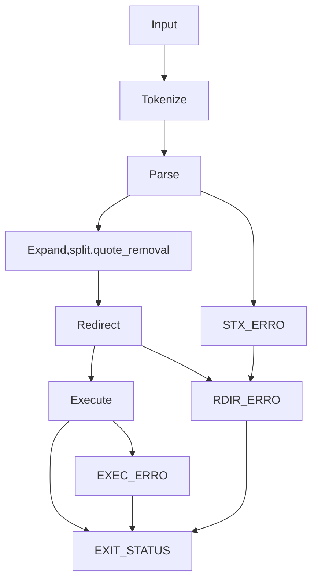

# Minishell
Ejercicio de 42 School para recrear Bash

## Cómo empezamos:
Esquema de ejecución de la shell:

```mermaid
graph TD;
    Input-->Tokenize;
    Tokenize-->Parse;
    Parse-->STX_ERRO;
    Parse-->Expand,split,quote_removal;
    Expand,split,quote_removal-->Redirect;
    Redirect-->Execute;
    Execute-->EXIT_STATUS;
    Redirect-->RDIR_ERRO;
    Execute-->EXEC_ERRO;
    STX_ERRO-->RDIR_ERRO;
    EXEC_ERRO-->EXIT_STATUS
    RDIR_ERRO-->EXIT_STATUS
```
